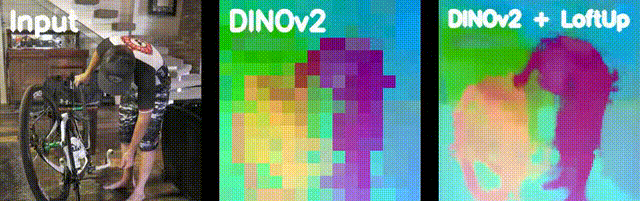
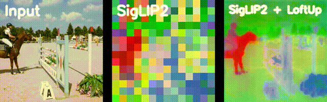

# [LoftUp: A Coordinate-Based Feature Upsampler for Vision Foundation Models](https://arxiv.org/abs/2504.14032)

ICCV2025 (oral)

[[Arxiv]](https://arxiv.org/abs/2504.14032) [[Project Page]](https://andrehuang.github.io/loftup-site/)

[Haiwen Huang](https://andrehuang.github.io/), Anpei Chen, Volodymyr Havrylov, Andreas Geiger, Dan Zhang


**TL;DR:** LoftUp achieves the strongest feature upsampling performance at a comparable speed to bilinear upsampling.






## Contents
- [Install](https://github.com/andrehuang/loftup/tree/main?tab=readme-ov-file#install)
- [Inference with pretrained upsamplers](https://github.com/andrehuang/loftup/tree/main?tab=readme-ov-file#inference-with-pretrained-upsamplers)
- [Evaluation on downstream tasks](https://github.com/andrehuang/loftup/tree/main?tab=readme-ov-file#inference-with-pretrained-upsamplers)
- [Training LoftUp upsamplers](https://github.com/andrehuang/loftup/tree/main?tab=readme-ov-file#inference-with-pretrained-upsamplers)
- [Citation](https://github.com/andrehuang/loftup/tree/main?tab=readme-ov-file#inference-with-pretrained-upsamplers)

## Install

In general, LoftUp can run with most recent pytorch environments. We encourage the users to try out LoftUp in their exisitng environment first.

We also provide two yaml file for installation. To use them, simply run:

```bash
conda env create -f environment_cuda11.yaml
```

or 

```bash
conda env create -f environment.yaml
```


## Inference with pretrained upsamplers

All pre-trained upsamplers are available on 🤗 here: https://huggingface.co/models?search=loftup.

We provide example code for using LoftUp in [example_usage.py](example_usage.py). Currently we provide:


|Backbone Name          | Featurizer Class              | HF hub                                  | Torch Hub Repo | Torch Hub Name |
|-------------------| ---|------------------------------------------------|------|-----|
| DINOv2 S/14     | [dinov2](featurizers/DINOv2.py)     | [haiwen/loftup-dinov2s](https://huggingface.co/haiwen/loftup-dinov2s)   | andrehuang/loftup | loftup_dinov2s|
| DINOv2 S/14 + Reg | [dinov2s_reg](featurizers/DINOv2.py)     | [haiwen/loftup-dinov2s_reg](https://huggingface.co/haiwen/loftup-dinov2s_reg)| andrehuang/loftup | loftup_dinov2s_reg|
| DINOv2 B/14 | [dinov2b](featurizers/DINOv2.py) | [haiwen/loftup-dinov2b](https://huggingface.co/haiwen/loftup-dinov2b) | andrehuang/loftup | loftup_dinov2b|
| DINOv2 B/14 + Reg | [dinov2b_reg](featurizers/DINOv2.py)     | [haiwen/loftup-dinov2b_reg](https://huggingface.co/haiwen/loftup-dinov2b_reg)|andrehuang/loftup | loftup_dinov2b_reg|
| CLIP ViT B/16 | [clip](featurizers/CLIP.py) |[haiwen/loftup-clip](https://huggingface.co/haiwen/loftup-clip) | andrehuang/loftup | loftup_clip|
|SigLIP ViT B/16 | [siglip](featurizers/SigLIP.py) | [haiwen/loftup-siglip](https://huggingface.co/haiwen/loftup-siglip)| andrehuang/loftup | loftup_siglip|
|SigLIP2 ViT B/16 | [siglip2](featurizers/SigLIP.py) | [haiwen/loftup-siglip2](https://huggingface.co/haiwen/loftup-siglip2)| andrehuang/loftup | loftup_siglip2|

To use torch hub checkpoints, simply run 
```python
upsampler = torch.hub.load('andrehuang/loftup', model_torch_hub_name, pretrained=True)
```
For example, ```upsampler = torch.hub.load('andrehuang/loftup', loftup_dinov2s, pretrained=True)```.

The upsampler class is defined at [UpsamplerwithChannelNorm](https://github.com/andrehuang/loftup/blob/7ce8a97e720465819a2a6b24a7c24c192da394b6/upsamplers/upsamplers.py#L109).

## Evaluation on Downstream Tasks

### Dataset Preparation

See [Preparing Datasets for Evaluation](datasets/README.md).

### Semantic Segmentation
For semantic segmentation, our implementation is adapted from [FeatUp](https://github.com/mhamilton723/FeatUp). You can use [eval_seg.py](eval_seg.py) by running:

```bash
python eval_seg.py  ++upsampler_path=/path/to/your/upsampler
```

You can also configure other hyper-parameters such as output_dir and dataset directory. The config file is [configs/eval_seg.yaml](configs/eval_seg.yaml). 

### Video Object Segmentation
For video object segmentation on DAVIS, our code is modified from the implementation in [LiFT](https://github.com/saksham-s/lift). Specifically, we first extract segmentaiton results by  running:

```bash
    python eval_davis.py --dataroot your_davis_data_dir --model_type "dinov2" --output_dir your_output_dir --imsize 224 --upsampler_path=your_upsampler_path
```

Then run the following to get evaluation results:

```bash
python davis2017-evaluation/evaluation_method.py --davis_path /your_davis_data_dir --task semi-supervised --results_path your_output_dir/davis_vidseg_224 --imsize 224
```

### Others
For interactive segmentation, please check out [iSegProbe](https://github.com/havrylovv/iSegProbe).

For open-vocabulary segmentation, please check out [ProxyCLIP](https://github.com/mc-lan/ProxyCLIP).

For depth and normal estimation, please check out [Probe3D](https://github.com/mbanani/probe3d).


## Training LoftUp
We will provide training code soon.

## Citation
If you find our work helpful, please cite:

```
@misc{huang2025loftuplearningcoordinatebasedfeature,
      title={LoftUp: Learning a Coordinate-Based Feature Upsampler for Vision Foundation Models}, 
      author={Haiwen Huang and Anpei Chen and Volodymyr Havrylov and Andreas Geiger and Dan Zhang},
      year={2025},
      eprint={2504.14032},
      archivePrefix={arXiv},
      primaryClass={cs.CV},
      url={https://arxiv.org/abs/2504.14032}, 
}
```
