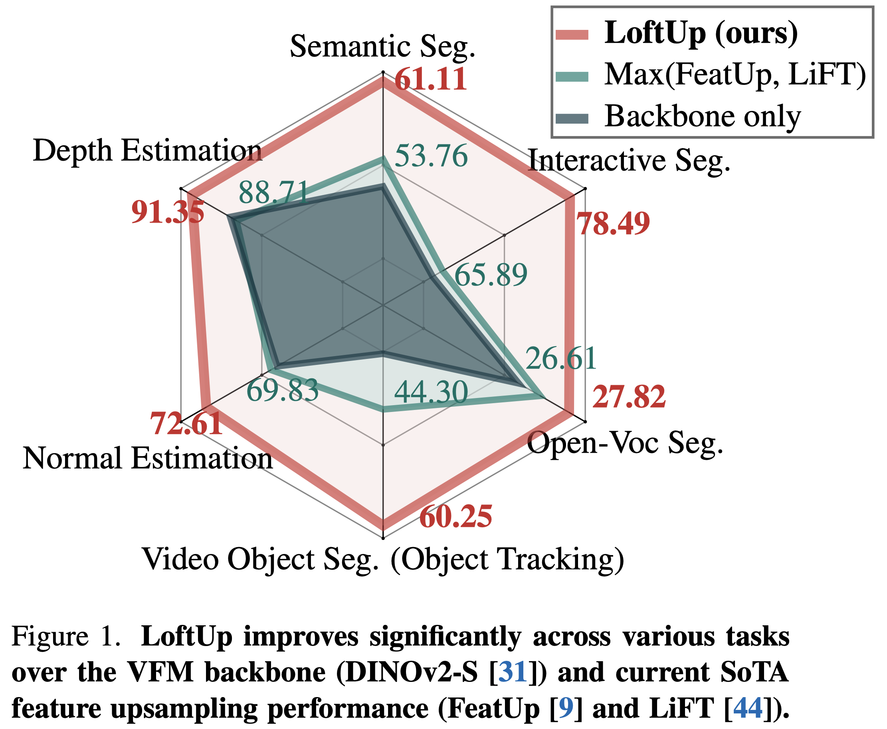

# LoftUp: A Coordinate-Based Feature Upsampler for Vision Foundation Models

[Haiwen Huang](https://andrehuang.github.io/), Anpei Chen, Volodymyr Havrylov, Andreas Geiger, Dan Zhang

**TL;DR:** LoftUp achieves the strongest feature upsampling performance at a comparable speed to bilinear upsampling.

## TODO
- [ ] Install
- [x] Inference with pretrained upsamplers
- [ ] Evaluation on downstream tasks
- [ ] Training LoftUp upsamplers
- [ ] Citation

## Install
Inference with LoftUp requires minimum packages (e.g. Python >= 3.9, Pytorch >= 1.13). We encourage the users to directly try using LoftUp with any recent Pytorch environment they already have.

For training, we will provide a yaml file for creating an environment soon.

## Inference with pretrained upsamplers
We provide example code for using LoftUp in [example_usage.py](example_usage.py). Currently we provide:
- DINOv2 S/14 upsampler: [[Google Drive Link]](https://drive.google.com/file/d/1Sse4gq2dCSNT-rnTVja7pG9ogIGfT0Ue/view?usp=drive_link)

We are going to release soon:
- DINOv2 S/14 with registers, DINOv2 B/14, and DINOv2 B/14 with registers
- CLIP ViT-B upsampler
- RADIO ViT-B upsampler
- SigCLIP
- SigCLIP 2

## Evaluation on Downstream Tasks

We will provide code for semantic segmentation.

For open-vocabulary segmentation, please check out [ProxyCLIP](https://github.com/mc-lan/ProxyCLIP).

For depth and normal estimation, please check out [Probe3D](https://github.com/mbanani/probe3d).

For video object segmentation, please check out the implementation from [LiFT](https://github.com/saksham-s/lift). 

For interactive segmentation, we will provide a separate code repository later. Stay tuned!

## Training LoftUp
We will provide training code soon.